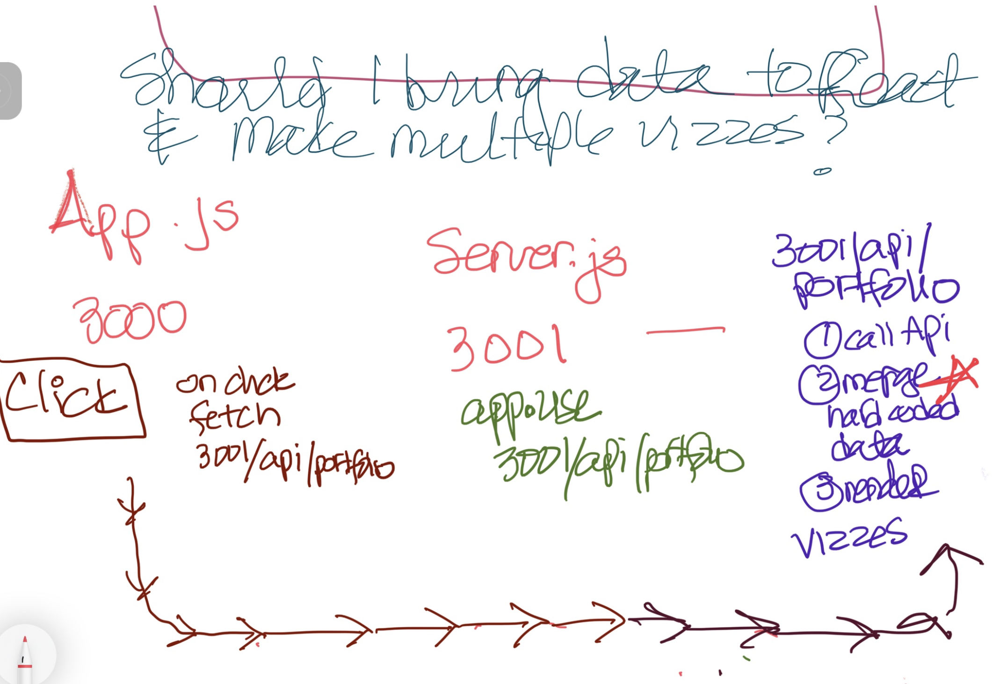

# Let's just take a step back and look at where we are and where we want to go

The purpose of this app is to build a handy portfolio checker for the person who wants a picture of how selected assets are performing in relation to one another and to the portfolio as a whole. 

As this is meant to be a custom app, a client's principal holdings will be hardcoded to use as a baseline for comparison an real time. The real time share prices will be accessed through yahoo finance api, accessed through rapid api. 

Because I intent to build out user interaction, I want to build the front end in react, however, I would prefer not to make repeated API calls in a single session. Additionally, in order to make customer centric visualizations I need to merge current prices with the principal variables. This is all better handled in the back end. 




Above is the process I envision. It starts on the left when the client arrives at the App.js. If the user click the button to enter the site, the app will re-route to the backend route on the server. There, the yahoo api will return the current prices for 16 stocks. This api data will be merged with a hardcoded data set. This data set will be used to render different views of the customer portfolio. I haven't decided if I will return the data to the front end to render visualizations in d3 react, or if I will do it in the backend. 

Currently I'm getting the following errors. 

**/3000**


**/3008**


**/3008/api/portfolio**


### Test Code 

```    

   // console.log(
      " Symbol: " 
      // + JSON.stringify(response.data.quoteResponse.result[1].symbol ) + 
      // " aka: " + JSON.stringify(response.data.quoteResponse.result[1].longName ) + 
      // " Exchange Name: " + JSON.stringify(response.data.quoteResponse.result[1].fullExchangeName ) + 
      // " Today's Price: " + JSON.stringify(response.data.quoteResponse.result[1].regularMarketPrice ) + 
      // " Today it's worth: " + JSON.stringify(response.data.quoteResponse.result[1].regularMarketPrice*hardcodedData[1].shares) + 
      // " When I bought it I paid:  " + JSON.stringify(hardcodedData[1].purchasePrice*hardcodedData[1].shares) +
      // " PercentChange:  " + JSON.stringify((((response.data.quoteResponse.result[1].regularMarketPrice - hardcodedData[1].purchasePrice)/(response.data.quoteResponse.result[1].regularMarketPrice))*11))+
      // "  Total Change:  " + JSON.stringify((response.data.quoteResponse.result[1].regularMarketPrice-hardcodedData[1].purchasePrice)*hardcodedData[1].shares)
      //);
```
```
const hardcodedData = [
  { symbol: "GOOGL", purchasePrice: 143.49, shares: 100, principalDate: '12/22/2021', exchangeName: 'NasdaqGS' },
  { symbol: "TSLA", purchasePrice: 242.54, shares: 45, principalDate: '11/27/2020', exchangeName: 'NasdaqGS' },
  { symbol: "AMZN", purchasePrice: 160.00, shares: 80, principalDate: '11/27/2020', exchangeName: 'NasdaqGS' },
  { symbol: "BA", purchasePrice: 188.59, shares: 25, principalDate: '12/14/2022', exchangeName: 'NYSE' },
  { symbol: "COIN", purchasePrice: 257.31, shares: 50, principalDate: '12/28/2021', exchangeName: 'NasdaqGS' },
  { symbol: "AAPL", purchasePrice: 114.56, shares: 200, principalDate: ' 11/23/2020', exchangeName: 'NasdaqGS' },
  { symbol: "CVS", purchasePrice: 89.83, shares: 25, principalDate: '1/11/2023', exchangeName: 'NYSE' },
  { symbol: "GS", purchasePrice: 342.94, shares: 10, principalDate: '1/24/2022', exchangeName: 'NYSE' },
  { symbol: "MS", purchasePrice: 98.39, shares: 25, principalDate: '12/22/2021', exchangeName: 'NYSE' },
  { symbol: "NVDA", purchasePrice: 293.75, shares: 5, principalDate: '12/22/2021', exchangeName: 'NasdaqGS' },
  { symbol: "PYPL", purchasePrice: 191.57, shares: 10, principalDate: '12/22/2021', exchangeName: 'NasdaqGS' },
  { symbol: "PFE", purchasePrice: 47.45, shares: 100, principalDate: '11/10/2022', exchangeName: 'NYSE' },
  { symbol: "CRM", purchasePrice: 160.38, shares: 20, principalDate: '10/21/2022', exchangeName: 'NYSE' },
  { symbol: "SBUX", purchasePrice: 102.99, shares: 25, principalDate: '12/14/2022', exchangeName: 'NasdaqGS' },
  { symbol: "DIS", purchasePrice: 151.93, shares: 10, principalDate: '12/22/2021', exchangeName: 'NYSE' },
  { symbol: "VTI", purchasePrice: 239.05, shares: 10, principalDate: '12/22/2021', exchangeName: 'NYSEArca' },
  { symbol: "LI", purchasePrice: 32.53, shares: 225, principalDate: '11/13/2020', exchangeName: 'NasdaqGS' }

];
```


